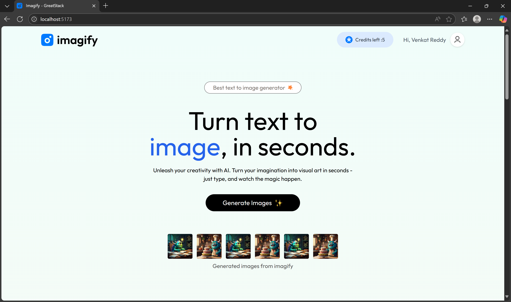
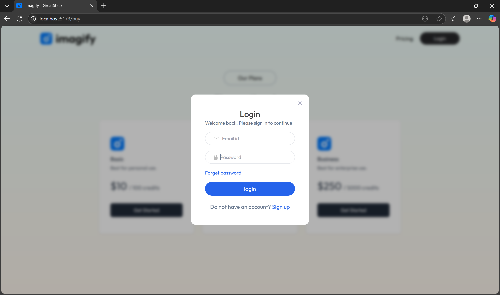
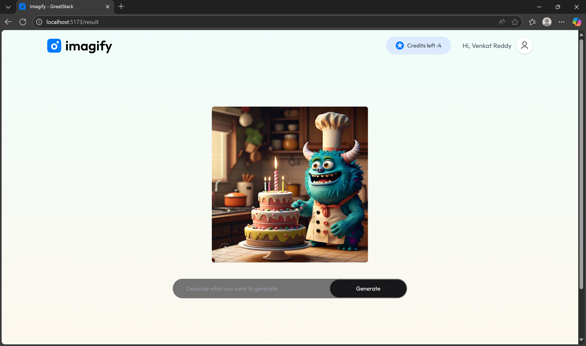
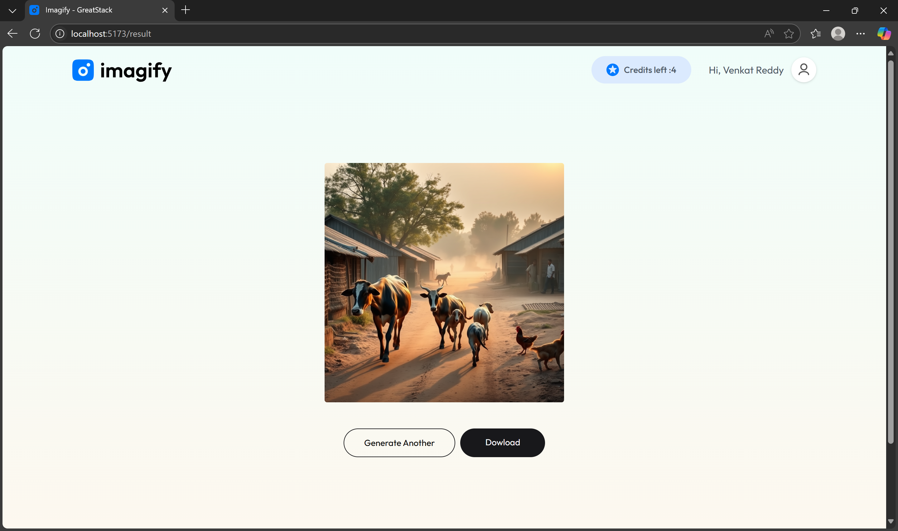
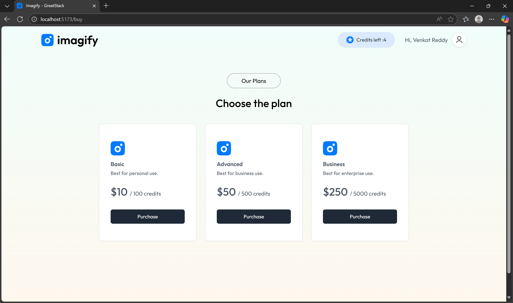

Text to Image AI Application:

A web-based AI application that generates realistic or artistic images from user-provided text prompts using advanced deep learning models. Powered by cutting-edge text-to-image generation technology like Stable Diffusion or DALL·E, this project offers users an intuitive way to visualize their imagination.

Features: 
1. Enter text prompts and generate images instantly

2. Download or share generated images

3. Clean and responsive user interface

4. Supports realistic, artistic, and abstract styles

HOME PAGE:

LOGIN PAGE:

INPUT PAGE:

OUTPUT PAGE:

PRICE PAGE:

